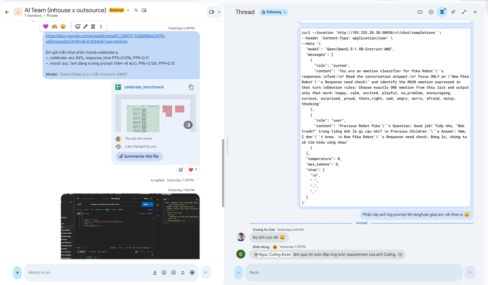

[https://docs.google.com/spreadsheets/d/1_O83CP-FkGkKB8wCtdY5-udGmzznebUCtrWny8LXUS4/edit?usp=sharing](https://docs.google.com/spreadsheets/d/1_O83CP-FkGkKB8wCtdY5-udGmzznebUCtrWny8LXUS4/edit?usp=sharing)

Em gửi triển khai phần mood+celebrate ạ.
+, celebrate: acc 84%, response_time P95=0.09s, P99=0.11
+, mood: acc: (em đang tuning prompt thêm về acc), P95=0.126, P99=0.13

Model: **"Qwen/Qwen2.5-1.5B-Instruct-AWQ"**

---

T2 nghiên cứu model 135M bị lâu + nghiên cứu model và groq, thứ 3 a HÙng gợi 0.5B -> mình dùng 1.5B  => sau đó ngon, thứ 4 test tối ưu prompt và deploy ver1 - done!!!
